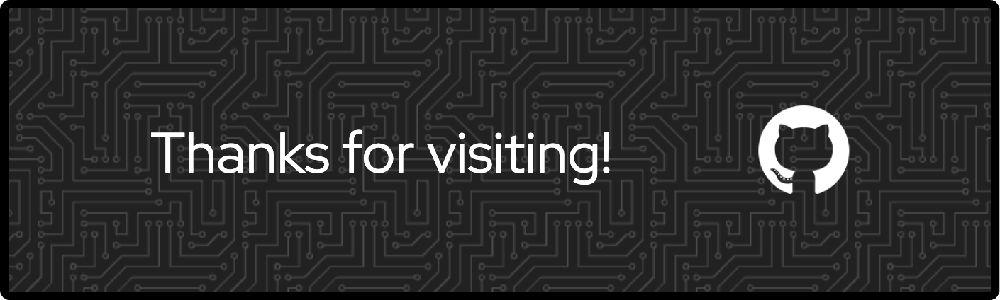

## 🌟 **About Me**
Hi there! As a dedicated student and software developer, I thrive on solving problems and bringing ideas to life through code. With a strong foundation in programming languages like C++, Java, and Python,  Outside of coding, I enjoy designing, reading, and exploring new technologies!

```
x──────────────x                                   x──────────────x
| * Welcome! * |                                   | * ~~~~~~~~ * |
x─────────────────────────────────────────────x    x─────────────────────────────────────────────x
│ Sarah Akhtar ⚘                              │    │ Additional Info:                            │
│                                             │    │                                             │
│ About Me:                                   │    │ x Hobbies: Design, Reading                  │
│ x Location: Stockton, CA                    │    │ x Skills: C++, Java, Python                 │
│ x Title: Student + Software Developer       │    │ x Interests: Backend/Fullstack Development  │
│ x Learning: Computer Science + PM           │    │ x Discord: @sarahak1786                     │
│ x Major: Computer Science                   │    │                                             │
│ x Email: s_akhtar@u.pacific.edu             │    │      𖡼𖤣𖥧𖡼𓋼𖤣𖥧𓋼𓍊𖡼.𖤣𖥧𖡼.𖤣𖥧𖡼𖤣𖥧𖡼𓋼𖤣𖥧𓋼𓍊𖡼.𖤣𖥧𖡼.𖤣𖥧        │  ༼ つ ◕_◕ ༽つ
x─────────────────────────────────────────────x    x─────────────────────────────────────────────x 
```
---

## 📊 **GitHub Stats**
<table>
  <tr>
    <td>
      <a href="https://git.io/awesome-stats-card">
        
      </a>
    </td>
    <td>
      
    </td>
  </tr>
</table>

---

## 💻 **Technical Skills**
<p align="center">
  <a href="https://skillicons.dev">
    
  </a>
</p>

---

